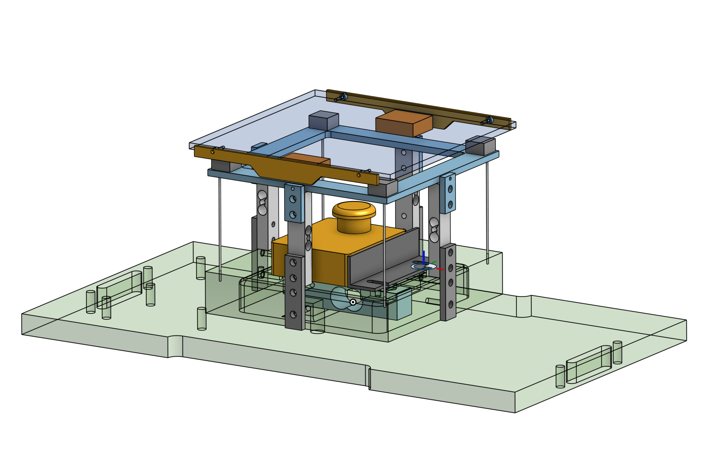
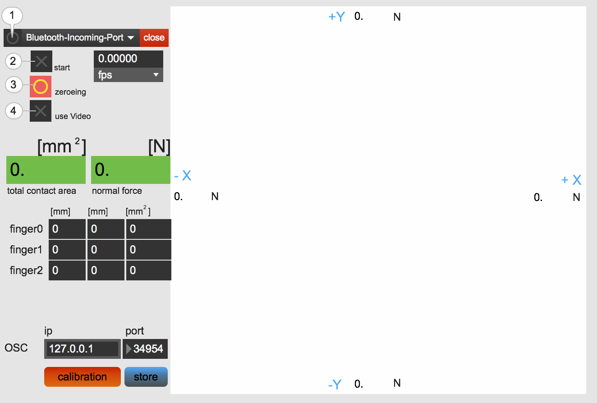

# The TouchBox
A low-cost DIY interface for tracking the position of up to three fingers in contact with its top surface, measuring their contact areas as well as 3D (normal and lateral) forces, and providing complex vibrotactile feedback.

---

## Content

* Software:
	1. GUI - based on [MaxMSP](https://cycling74.com). You don't need a license to run this patch
	2. Example Patches for vibration and optional audio feedback.
	3. [Arduino](http://arduino.cc/) code
	4. [OpenMV](https://openmv.io/) code

* Hardware:
	1. 3D models (STEP) and plans (PDF) - made with [OnShape](https://onshape.com)
	2. electronics schematics - made with [Eagle](https://www.autodesk.com/products/eagle/overview)
	3. list of required hardware

* README.md

---
## Software

* Follow the steps:
	1. Refresh the list of all attached USB-devices and select the aurduino (probably appearing as 'usbmodem1411' or similiar)
	2. Start application
	3. zeroeing all force sensors

* For sending the data to another application via OSC, enter the ip and port number.

* If you need to calibrate the software, press "calibration" and once done "store"

## OSC communication protocoll

### /touch/weight \<force>
force = float in [Newton]

### /touch/shear/up \<force>
force = float in [Newton]

### /touch/shear/down \<force>
force = float in [Newton]

### /touch/shear/left \<force>
force = float in [Newton]

### /touch/shear/right \<force>
force = float in [Newton]

### /touch/finger \<id> \<posX> \<posY> \<area>
id = int (identification id of finger, starts with 0)

posX = int in [pixel from center]

posY = int in [pixel from center]

area = float in [mm^2]

## Installation

For running the GUI, you need to install [MaxMSP](https://cycling74.com).

---

## Licenses

The arduino and openMV code is licensed under [GNU](http://www.gnu.org/licenses/)

for everything else:  

## Release

