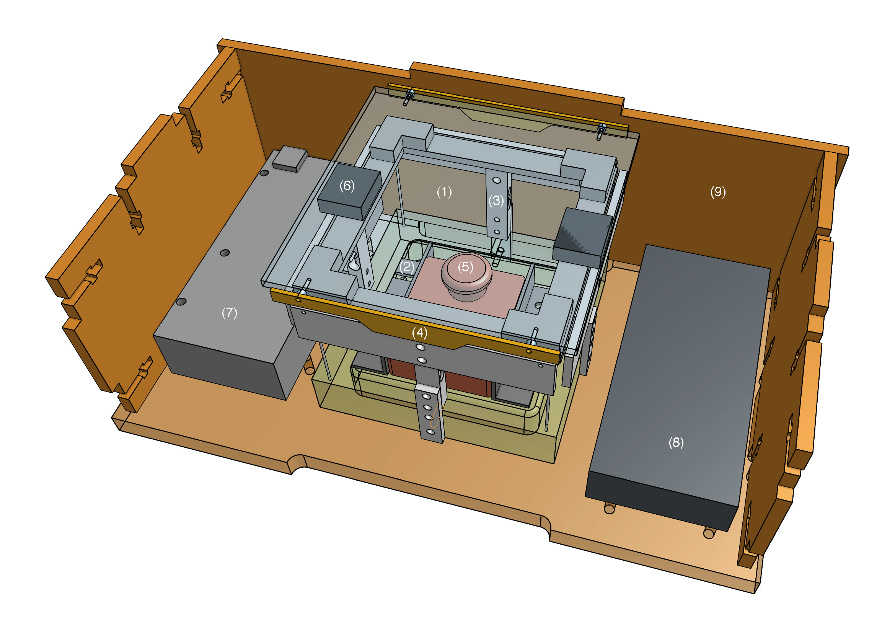
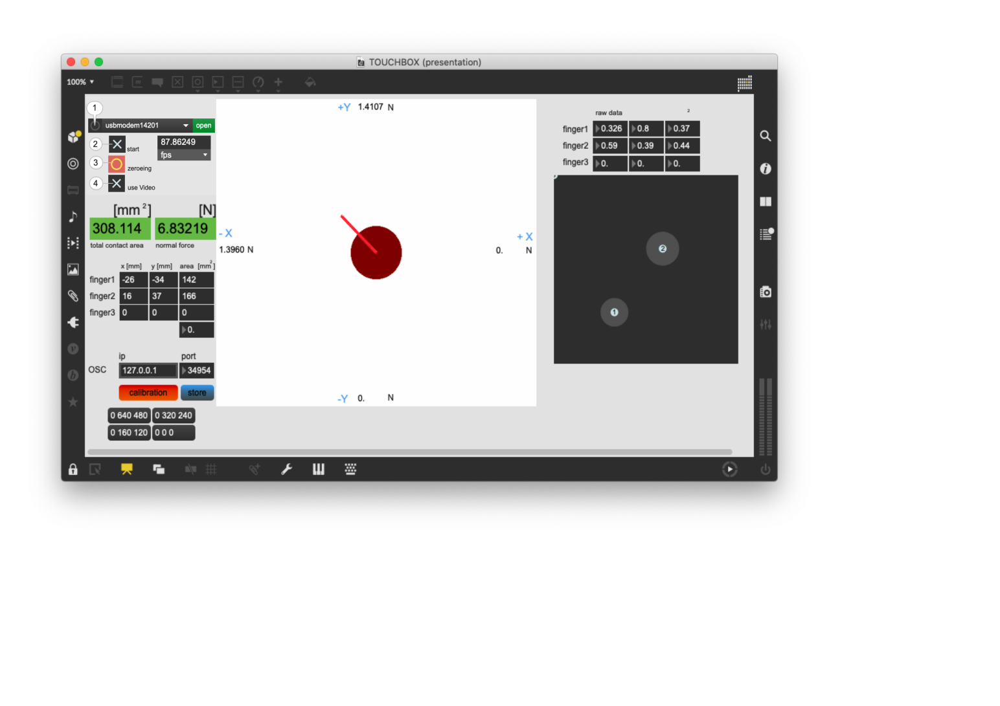

# The TouchBox MK3
A low-cost DIY interface for tracking the position multiple fingers (currently up to three) in contact with its top surface, measuring their contact areas as well as 3D (normal and lateral) forces, and providing rich vibrotactile feedback.

---
## Content

* Software:
	1. GUI - based on [MaxMSP](https://cycling74.com) (No license required to run this patch).
	2. Example Patches for vibration and optional audio feedback.
	3. [Arduino](http://arduino.cc/) code.
	4. [OpenMV](https://openmv.io/) code.

* Hardware:
	1. list of required hardware (file HardwareList.md).
	2. 3D models (STEP) and plans (PDF) - made with [OnShape](https://onshape.com).
	3. electronics schematics - made with [Eagle](https://www.autodesk.com/products/eagle/overview).

* README.md (this).

---
## Software

* Follow these steps:
	1. Refresh the list of available devices and select the Arduino (usually labeled 'usbmodem####');
	2. Toggle 'start';
	3. Reset force sensors. Press 'zeroing';
	4. For finger tracking via an openMV module, switch on 'use Video'.

* For sending the data to another application via OSC, enter ip and port numbers.

* If you need to calibrate the software, press "calibration" and once done "store".

## OSC communication protocol

### /touch/weight \<force>
force = float in [Newton]

### /touch/shear/up \<force>
force = float in [Newton]

### /touch/shear/down \<force>
force = float in [Newton]

### /touch/shear/left \<force>
force = float in [Newton]

### /touch/shear/right \<force>
force = float in [Newton]

### /touch/finger \<id> \<posX> \<posY> \<area>
id = int (identification id of finger, starts with 0)

posX = int in [pixel from center]

posY = int in [pixel from center]

area = float in [mm^2]

## Installation

For running the GUI, you need to install [MaxMSP](https://cycling74.com).
No license needed.

---
## Licenses

The Arduino and openMV code is licensed under [GNU](http://www.gnu.org/licenses/).

For everything else:  

---
## Release

